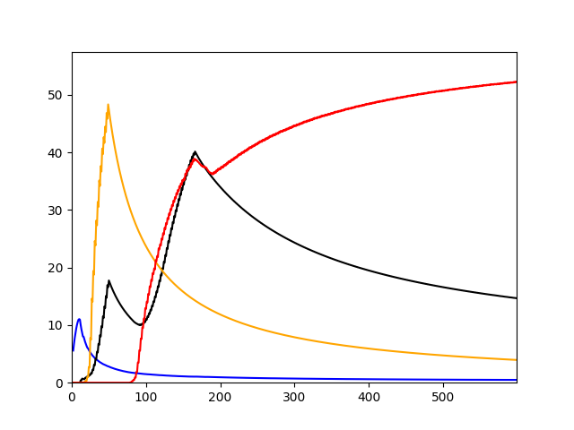
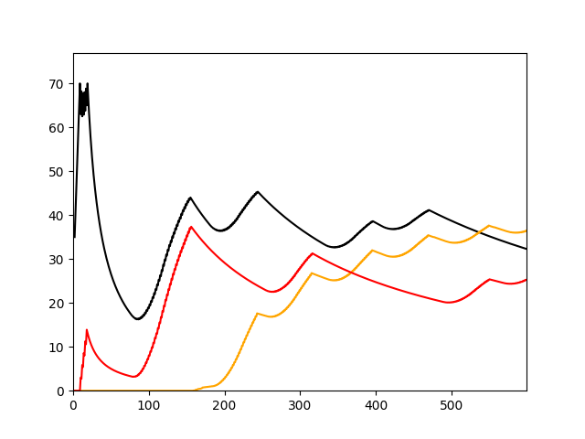
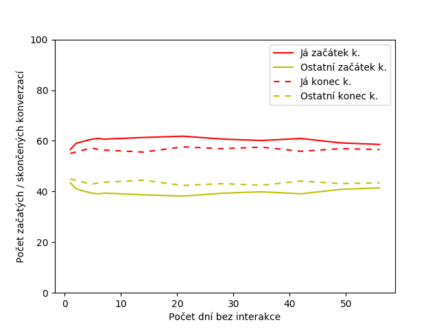
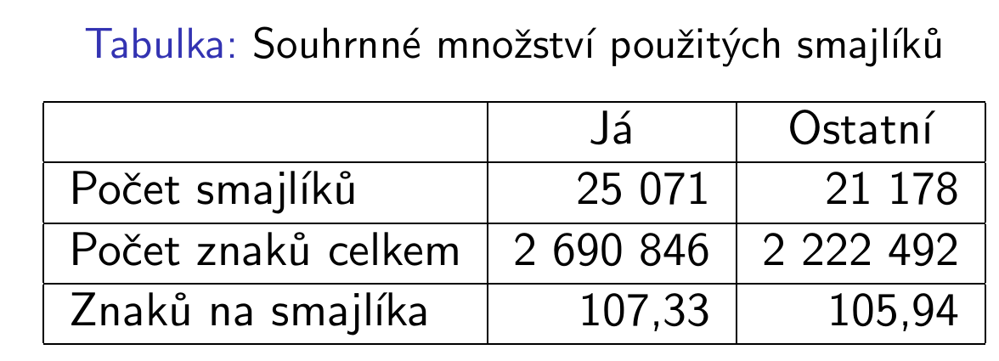
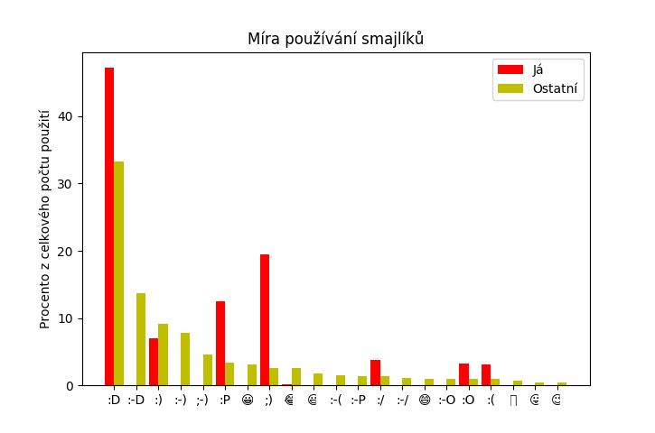

#IB111 -- Projekty
###Ronald Luc, 235313

#####Zdrojový kód
Všecheny zdrojové kódy jsou k dispozici na https://github.com/norik16/projects-IB111

<div style="page-break-after: always;"></div>
###Strategická hra

Vzhledem k výběru projektu v období voleb do PS jsem si jako hru vybral právě vládnutí PS.

#####Pravidla

Je dán vtipně pojatý, silně zjednodušený model voleb do PS a následného vládnutí. Strany mohou ovlivnit pouze jak moc si věří do dalších voleb (```selfesteem```, rozsah 0--100), že toho zvládnou prosadit a jakou měrou budou pracovat pro dobro občanů, nebo svoji kapsu (```plunder```, rozsah 0--1; 0 = nulové kradení, 1 = úplné kradení).

Vnitřně se pak každé straně počítá především jakou má karmu (slouží k zohlednění chování z minulých kol a setrvačnosti), která se odvíjí od množství splněných slibů z minulého kola.

Cílem je vydělat co nejvíce peněz v průměru za volební období. Peníze se získávají jako procenta zastoupení v PS × míra drancování.

#####Strategie

######Smart
- Základní strategie, když se daří (je ve vládě) zvyšuje procentuální drancování státu, v opačném případě postupně drancování změnšuje

######SmartBinary
- Podobná jak Smart, ale drancování zvyšuje, jen pokud je nad svým "cílem" (```goal```), v opačném případě vůbec nedrancuje

######SmartLinear
- Podobná jak SmartBinary, ale drancování zvyšuje/snižuje tím víc čím dál od svého cíle je

######SmarterSelfesteem
- Podobná jak SmartLinear, ale kromě drancování upravuje i to, jak moc si věří. Pokud se dostane do PS, zvýší se jí ```selfesteem```, jinak sníží

<div style="page-break-after: always;"></div>
#####Vyhodnocování

Aby bylo vidět, jak jednotlivé strategie reagují na počet období, v kterých budou pracovat -- tzn. snažíme se zjistit hladovost jednotlivých strategií. Pro každou délku hry je celá samostatná simulace, protože chci aby byl program připraven na složitější strategie počítající s počtem volebních období do převratu (konce hry).

#####Výsledky

Dlouhodobě nejvýhodnější strategie je upravování jak míry drancování, tak velikosti volebních slibů (```selfesteem```) podle výsledků posledních voleb. Hra je naprogramována co nejvíce obecně, takže umožňuje vymyslet (spočetně) mnoho různých strategií pomocí volitelných proměnných. Níže uvedený příklad je jen základní, výchozí nastavení těchto strategií.

<div style="page-break-after: always;"></div>
- **modrá** -- Smart -- spočátku silná, ale nepřestane drásat, dokud nepřijde o karmu
- **černá** -- SmartBinary -- po 2. vrcholu se jí začnou střídat kola s velkým a 0 ziskem
- **oranžová** -- SmartLinear -- v každém kole si drží malý počet voličů, nevzpomatuje se
- **červená** -- SmarterSelfesteem -- ustálí se na velmi výhodném poměru karmy, vol. sliběch a drancování, když tedy dostane většinu PS, opravdu toho dokáže využít




Další graf ukazuje 3 téměř stejné SmartBinary strategie, které musí získat převahu v PS, aby si dovolily začít drancovat. Je vidět, jak drancování přeženou až se opět dostanou pod svůj ```goal``` a proces se opakuje.


Několik dalších zajímavých partií je připraveno ke spuštění v samotném kódu na githubu.


<div style="page-break-after: always;"></div>
###Zpracování dat

Vybral jsem si projekt jehož výsledky mě opravdu zajímají, a to zpracování mých dat z Facebooku.

Hlavní otázky byly:
- Mám chut’ napsat ostatním častěji než oni mě?
- Používám smajlíky stejně jako ostatní?

Data jsem získal přímo z Facebooku pomocí jejich oficiálního nástroje

Bylo je potřeba konkretizovat tak, aby byly číselně popsatelné:
1. Začínám konverzace častěji než ostatní?
2. Používám  smajlíky více než ostatní?
3. Používám jiné smajlíky než ostatní?

<div style="page-break-after: always;"></div>
#####1. Začánám konverzace častěji než ostatní?
- Ano, i při různé době mezi zprávami pro započetí nové konverzace se drží trend 3:2


#####2. Používám  smajlíky více než ostatní?
- Ano, ale při vztažení k celkovému počtu znaků píši v průměru o procento více normálních znaků na jednoho smajlíka



<div style="page-break-after: always;"></div>
#####3. Používám jiné smajlíky než ostatní?
- Nepoužívám vůbec smajlíky s nosem, ale při sečtení "stejných" smajlíků nezávisle na nosu se vychyluji jen v nepoužívání nejklasičtějšího ":)" smajlíka, naopak mnohokrát více používám ";)" a ":P" smajlíky.




<div style="page-break-after: always;"></div>
###Grafika

#####Fraktály


